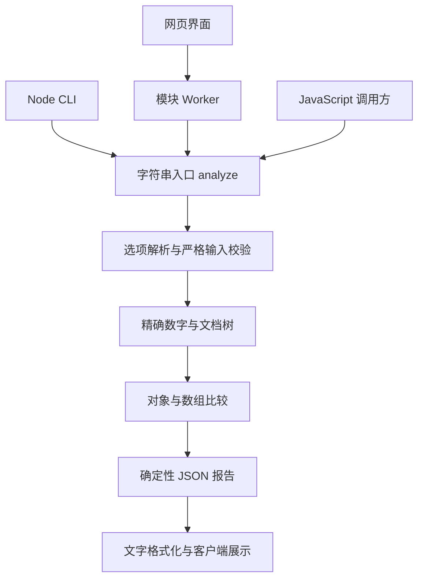

# MoonDiff JSON

[](https://github.com/inskr/moondiff-json/actions/workflows/ci.yml)

**用 MoonBit 精确比较两份 JSON，定位数据结构中的新增、删除、修改与重排。**

## 目录

- [项目用途](#项目用途)
- [核心能力](#核心能力)
- [安装与构建](#安装与构建)
- [CLI](#cli)
- [网页](#网页)
- [字符串 API 与比较规则](#字符串-api-与比较规则)
- [比较规则详解](#比较规则详解)
- [选项与资源限制](#选项与资源限制)
- [报告格式](#报告格式)
- [错误处理](#错误处理)
- [架构与源码导航](#架构与源码导航)
- [测试、CI 与打包](#测试ci-与打包)
- [常见问题](#常见问题)
- [贡献与许可证](#贡献与许可证)

## 项目用途

MoonBit 实现的 JSON 结构化差异库，提供 Node CLI 与静态网页，用于配置审查、API 回归和测试快照比较。
核心、CLI 和网页共享同一个字符串入口；支持严格 UTF-8、精确十进制数字、对象/位置数组/唯一键数组、忽略规则和确定性报告。

公开仓库：https://github.com/inskr/moondiff-json 。项目采用 MIT；依赖许可见 [THIRD_PARTY_NOTICES.md](THIRD_PARTY_NOTICES.md)。
只比较 JSON，不生成 Patch、不写回输入文件、不上传用户数据。与比较 MoonBit 源码的
[moonbit-community/moondiff](https://mooncakes.io/docs/moonbit-community/moondiff) 用途不同。

普通文本差异工具可以指出某一行发生变化，JSON 使用者通常还需要知道变化对应哪个字段、是否只是字段顺序不同、数组中同一个业务对象是否仍然存在，以及大整数是否真正相等。本项目将这些问题落实为可配置的结构比较和机器可读报告。

| 场景 | 典型做法 | 得到的结果 |
| --- | --- | --- |
| 配置审查 | 比较发布前后配置，忽略生成时间 | 定位实际配置修改 |
| API 回归 | 保存新旧响应，按 `id` 匹配列表元素 | 分辨对象修改、新增、删除和重排 |
| 测试快照 | 调用 `analyze`，检查 `ok` 和 `equal` | 将结构变化纳入自动化断言 |
| 数据检查 | 比较长整数 ID 或指数数字 | 避免浮点精度丢失导致误判 |
| 人工排查 | 网页导入文件并筛选变化类型 | 查看路径、前后值和下载报告 |

## 核心能力

| 能力 | 行为 |
| --- | --- |
| 结构比较 | 递归比较对象、数组及所有 JSON 基本类型；根可以是任意 JSON 值 |
| 精确数字 | `1`、`1.0`、`1e0` 等价；相邻大整数保持不同 |
| 严格输入 | 拒绝非法 JSON、重复解码键、非法 UTF-8 和超限输入 |
| 对象比较 | 忽略字段顺序及无关排版，按解码后的键匹配 |
| 位置数组 | 默认按共享索引比较，并处理尾部新增或删除 |
| 唯一键数组 | 显式指定身份字段，以字符串或精确整数匹配元素 |
| 顺序检测 | 可选检测身份数组共有身份的相对顺序 |
| 忽略规则 | 按指定对象路径跳过比较子树 |
| 可定位报告 | 分别保留旧、新 JSON Pointer 路径及值片段 |
| 确定性输出 | 相同输入与选项产生相同报告字节，不含时间或随机值 |
| 多入口一致 | API、CLI、浏览器 Worker 使用同一比较实现 |
| 本地运行 | 网页比较在浏览器内完成，无上传端点、CDN 或遥测 |

## 安装与构建

### 选择运行方式

| 方式 | 需要准备 | 适合谁 |
| --- | --- | --- |
| 从源码构建 | Git、固定 Node/MoonBit 工具链及项目依赖 | 开发、测试、修改代码 |
| 使用 CI 运行包 | Node.js 22 和完整运行包 | 直接运行 CLI 或网页 |
| 集成字符串 API | 构建生成的两个 ESM 模块 | 在 JavaScript 程序中调用 |

当前版本为 `0.1.0`，`package.json` 标记为 `private: true`，这里不提供 `npm install moondiff-json` 的安装方式。运行包获取方式见[测试、CI 与打包](#测试ci-与打包)。

### 获取源码

安装 Git 后执行，后续命令均在仓库根目录运行：

```bash
git clone https://github.com/inskr/moondiff-json.git
cd moondiff-json
```

### 工具链

固定 Node 22.23.3、moon 0.1.20260920、moonc/core 0.10.14+7d59c7ec9、moonjson 0.4.0、playwright-core 1.63.0。
工具装到项目 .tools，不修改系统 PATH 或 profile。版本下载链接标示 2026-11-20 到期；之后需重新选定并验证工具链。
详情与校验和见 [环境](docs/environment.md)。

安装脚本校验归档 SHA256；统一验收和打包要求固定 Node `v22.23.3`，运行包要求 Node 22。

### Windows x64

在 PowerShell 中逐条执行，非零退出时先处理错误：

```powershell
.\scripts\setup-windows.ps1
.\scripts\moon.ps1 version --all
npm.cmd ci
moon.exe update
npm.cmd run build:js
```

重新打开终端后，执行 `.\scripts\moon.ps1 version --all`，为当前终端载入已安装的项目工具，再运行 `node`、`npm.cmd` 或 `moon.exe`。

### Linux x64

需提供 Bash、curl、sha256sum、tar、unzip 和 Git；安装脚本不安装系统组件。在 Bash 中执行：

```bash
set -euo pipefail
bash scripts/setup-linux.sh
source scripts/moon-env.sh
npm ci
moon update
npm run build:js
```

新终端中运行 `source scripts/moon-env.sh` 可重新载入工具环境。

### 构建输出

```text
dist/
├── moondiff-json.mjs        # ESM 入口，补齐默认 options 参数
└── moondiff-json-core.mjs   # MoonBit 编译出的核心
```

两份文件必须在同一目录并一起保留。`dist/` 是构建产物，不随源码提交；克隆后先构建，再运行 CLI 或网页。

## CLI

### 第一次比较

```bash
node cli/moondiff-json.mjs --help
node cli/moondiff-json.mjs examples/config/old.json examples/config/new.json --options examples/config/options.json
node cli/moondiff-json.mjs examples/config/old.json examples/config/new.json --options examples/config/options.json --format json
```

语法：`node cli/moondiff-json.mjs old.json new.json [--format text|json] [--options options.json]`。
默认文字报告，选项默认 `{}`；路径有空格时加引号，以 `-` 开头的文件名放在 `--` 后。
报告写 stdout，诊断写 stderr。退出码 **0** 表示相等、**1** 表示正常差异、**2** 表示输入或运行错误。
配置示例只改变 timeout，预期退出 1。JSON 输出直接保留核心报告字节，不另加换行。

仓库示例旧配置为：

```json
{"timeout":30,"generated_at":"old","stable":true}
```

新配置为：

```json
{"stable":true,"generated_at":"new","timeout":60}
```

选项 `{"ignore_paths":["/generated_at"]}` 忽略生成时间。因此有效差异只有 `/timeout` 从 `30` 改为 `60`，字段换序不产生额外变化。

### 参数参考

| 参数 | 含义 |
| --- | --- |
| `old.json` / `new.json` | 旧、新文档文件路径 |
| `--format text` | 可读文字报告，默认值 |
| `--format json` | 结构化 JSON 报告 |
| `--options FILE` | 选项文件；省略时使用 `{}` |
| `--help` | 显示帮助，需单独使用 |
| `--version` | 显示版本，需单独使用 |
| `--` | 结束参数解析，其后允许以 `-` 开头的文件名 |

```bash
node cli/moondiff-json.mjs --version
node cli/moondiff-json.mjs old.json new.json
node cli/moondiff-json.mjs old.json new.json --options options.json --format json
node cli/moondiff-json.mjs "old config.json" "new config.json"
node cli/moondiff-json.mjs --format json -- -old.json -new.json
```

当前 CLI 读取两个文件，不提供 stdin 管道输入。

### 在脚本中处理退出码

| 退出码 | 含义 | 推荐处理 |
| ---: | --- | --- |
| `0` | 当前策略下相等 | 正常继续 |
| `1` | 比较成功，存在差异 | 展示报告或按业务需要阻止发布 |
| `2` | 输入、编码、选项或运行错误 | 检查 stderr 和错误报告 |

启用 `set -e` 的 Bash 脚本会把正常差异也视为非零退出，建议显式处理：

```bash
status=0
node cli/moondiff-json.mjs old.json new.json --format json > report.json || status=$?
case "$status" in
  0) echo "相等" ;;
  1) echo "发现差异，请查看 report.json" ;;
  *) echo "比较失败" >&2; exit "$status" ;;
esac
```

PowerShell 示例：

```powershell
node cli/moondiff-json.mjs old.json new.json --format json
$comparisonExit = $LASTEXITCODE
switch ($comparisonExit) {
    0 { Write-Host '相等' }
    1 { Write-Host '发现差异' }
    default { throw "比较失败，退出码：$comparisonExit" }
}
```

CI 中可以让退出码 1 表示快照检查不通过，也可以只保存报告供审核，由调用方决定。

文档和 options 保持原始字符串，禁止先用 JS JSON.parse 解析用户文档；非法 UTF-8 被拒绝。
数字不转为 JS Number：相邻大整数保持不同，1、1.0、1e0 等价。缺失值与真实 null 分别表示。

## 网页

```bash
npm run serve
# 或指定端口
npm run serve -- --port 8080
```

打开终端打印的 localhost /web/ 地址；Ctrl+C 停止。页面使用模块 Worker，需要 HTTP 服务。
支持文件导入、options、取消、示例、筛选、分页与完整 JSON 下载；比较和报告仍由 MoonBit 核心完成。
服务只有本地静态 GET/HEAD，无上传端点、CDN 或遥测。页面载入并显示“核心就绪”后可离线比较；
刷新离线加载不在 v1 范围。静态托管需要保留完整 web/ 和两个 dist 模块的相对位置。

默认端口由系统选择，服务仅监听 `127.0.0.1`；Windows 中可用 `npm.cmd` 代替 `npm`。

1. 等待页面显示“核心就绪”。
2. 粘贴或导入旧、新 JSON。
3. 按需填写或导入比较选项，默认 `{}`。
4. 点击“比较 JSON”，查看计数、路径和前后片段。
5. 按新增、删除、修改、重排筛选，分页查看详情。
6. 下载完整 JSON 报告；筛选和分页只影响展示。

页面内置配置审查、API 用户数组、精确大整数、重复身份错误四个示例，支持取消比较。模块 Worker 需要 HTTP 环境，请通过本地服务访问，而不是直接双击 HTML。项目不包含服务端比较 API。

## 字符串 API 与比较规则

```javascript
import { analyze, format_text } from './dist/moondiff-json.mjs';
const report = analyze('9007199254740992', '9007199254740993', '{}');
console.log(report);
console.log(format_text(report));
```

默认数组按位置比较；唯一键规则示例：

```json
{"array_rules":[{"path":"/users","key":"id","check_order":false}],"ignore_paths":["/meta"]}
```

身份只允许字符串或精确整数，缺失、重复或非法身份报错；字符串 "1" 与整数 1 不同。
路径采用 RFC 6901，旧新路径分别记录。输入始终先严格校验，忽略不能绕过重复键或资源上限。
默认每侧 2 MiB、100000 节点、深度 64，最多 10000 条变化；超限返回完整错误，不截断成功报告。
详见 [比较语义](docs/semantics.md) 和 [选项、限制与报告](docs/reports-and-options.md)。

### API 返回值与异常

`analyze(oldText, newText, optionsText = '{}')` 是同步接口，返回 JSON 报告字符串。浏览器产品在 Worker 中运行它。可将下例保存为仓库根目录的 `compare.mjs`，构建后执行 `node compare.mjs`：

```javascript
import { analyze, format_text } from './dist/moondiff-json.mjs';

const reportText = analyze('{"timeout":30}', '{"timeout":60}');
const report = JSON.parse(reportText);
if (!report.ok) {
  console.error(report.error.code, report.error.message);
  process.exitCode = 2;
} else {
  console.log('是否相等：', report.equal);
  console.log('变化统计：', report.summary);
  process.stdout.write(format_text(reportText));
}
```

允许解析返回的报告外层对象，但用户输入必须保留原始文本。先对输入 `JSON.parse` 再 `JSON.stringify`，可能在到达核心前损失大整数精度。报告的 `json_text` 和 `identity.value_json` 特意使用字符串，也应保留其精度。

```javascript
const different = JSON.parse(analyze('9007199254740992', '9007199254740993'));
console.log(different.equal); // false
const equivalent = JSON.parse(analyze('1.0', '1e0'));
console.log(equivalent.equal); // true
```

`format_text(reportText)` 校验已有报告后返回以换行结尾的文字，不重新比较文档。损坏报告会抛出 `MoonDiffFormatError`，其 `report_text` 属性包含核心生成的错误报告：

```javascript
try {
  console.log(format_text('{"invalid":"report"}'));
} catch (error) {
  if (error.name !== 'MoonDiffFormatError') throw error;
  console.error(error.report_text);
}
```

`client_error(code, message, side)` 用于客户端错误适配，返回同协议报告字符串。code 只允许 `IO_ERROR`、`ENCODING_ERROR`、`INVALID_OPTIONS`；side 为 `old`、`new`、`options` 或空字符串，空字符串输出为 null。

入口还导出诊断探针 `probe_document`，它使用独立协议；业务集成应使用正式的 analyze 和 format_text。

## 比较规则详解

### 对象、基本类型和精确数字

对象按解码后的字段名匹配，按 Unicode 码点顺序深度优先输出变化。字符串不做 Unicode 规范化。同类型容器递归比较；完整容器整体新增、删除只报告一次，不展开全部后代。类型变化报告一次 modified。

| 旧值 | 新值 | 结果 |
| --- | --- | --- |
| `{"a":1,"b":2}` | `{"b":2,"a":1}` | 相等 |
| `1` | `1.0` | 相等 |
| `1e0` | `1.00` | 相等 |
| `9007199254740992` | `9007199254740993` | 修改 |
| `"1"` | `1` | 修改，字符串与数字不同 |
| `{}` | `{"a":null}` | 新增 /a，缺失与 null 不同 |
| `{"a":1}` | `{"a":{"b":2}}` | /a 类型改变，报告一次修改 |

解析器保留数字原始 token，核心正规化为精确表示进行比较，不使用浮点近似值判断相等。报告片段保留各侧原始数字 token。这里提供数字比较，不是通用高精度算术库。

### 数组按位置比较

未配置规则的数组按共享索引比较，然后处理尾部新增、删除。`[1,2]` 变成 `[1,2,3]` 会报告尾部新增；中间插入元素可能导致后续下标错位，产生多条修改。这是位置比较的预期行为，不执行最短编辑序列或自动身份推断。

### 数组按唯一身份比较

下面两份文档只有顺序变化：

```json
{"users":[{"id":1,"name":"Alice"},{"id":2,"name":"Bob"}]}
```

```json
{"users":[{"id":2,"name":"Bob"},{"id":1,"name":"Alice"}]}
```

使用 `{"array_rules":[{"path":"/users","key":"id","check_order":false}]}` 时相等。改为 `check_order: true` 会报告一条数组级 reordered。顺序检查只关注共有身份的相对顺序，仅新增或删除首项不会单独触发重排。

- 每个元素必须是对象，并包含 key 指定的直接属性；不会自动猜测 id 或 name。
- 身份允许字符串或精确数学整数；`1.2e1` 是整数，`0.1` 不是。
- 数字 `1` 与 `1.0` 属于同一身份；字符串 `"1"` 与数字 `1` 不同；`0` 与 `-0` 相同。
- 身份缺失、重复或类型非法返回 `INVALID_ARRAY_KEY`，不退回位置比较。
- 身份改变表现为删除旧元素并新增新元素；同身份对象继续递归比较。
- 路径允许根数组 `""` 或经对象成员到达数组，不支持穿过其他数组配置嵌套身份规则。
- 未被整体忽略的规则至少在一侧定位到数组；双方均不存在或某侧存在非数组值会报选项错误。

旧、新下标可能不同，因此报告分别记录 old_path、new_path，并附带身份上下文。输出采用确定性身份键排序，不保证按数值大小排序。

### 忽略路径与定位

```json
{"ignore_paths":["/generated_at","/meta/request_id"]}
```

忽略路径按 RFC 6901 解码后匹配，不是文本前缀、正则或通配符。根不能忽略，重复路径去重。当前忽略路径经对象成员定位，不能进入数组内部，但可以忽略整个数组字段。

严格输入校验先于忽略，被忽略部分仍需满足语法、重复键、数字和资源限制。整体忽略身份数组或其父对象时，会跳过对应数组的数据身份校验。

忽略不是脱敏：整体新增父容器等报告片段可能仍包含被忽略后代的数据，分享报告前应检查实际内容。

| JSON Pointer | 含义 |
| --- | --- |
| `""` | 根节点 |
| `/` | 根对象的空字符串字段名 |
| `/users/0/name` | users 数组第一个元素的 name |
| `/a~1b` | 字段名 a/b |
| `/a~0b` | 字段名 a~b |

路径中的 `~` 转义为 `~0`，`/` 转义为 `~1`。报告可以定位数组下标，但配置路径仍受上述规则限制。

## 选项与资源限制

选项必须是对象，仅允许 ignore_paths、array_rules、limits。未提供字段使用默认值；各层未知字段、错误类型、缺少必要规则字段及重复规则路径均报错。

```json
{
  "ignore_paths": ["/generated_at"],
  "array_rules": [{"path":"/users","key":"id","check_order":true}],
  "limits": {
    "max_input_bytes": 2097152,
    "max_nodes": 100000,
    "max_depth": 64,
    "max_changes": 10000
  }
}
```

此配置要求输入中存在满足规则的 /users 数组。普通配置文件应删除不适用的 array_rules。

| 限额 | 默认最大值 | 最小值 | 含义 |
| --- | ---: | ---: | --- |
| max_input_bytes | 2097152 | 1 | 每侧 UTF-8 字节数，默认 2 MiB |
| max_nodes | 100000 | 1 | 每侧文档节点数 |
| max_depth | 64 | 0 | 根深度为 0 |
| max_changes | 10000 | 1 | 包含 reordered 的所有变化 |

限额只能下调，且必须是精确数学整数；`1.0` 和 `1e0` 按整数 1 处理。选项自身先用默认输入限额解析，再把配置应用于旧、新文档。

数字 token 最多 256 个 ASCII 字符，显式指数绝对值最多 10000，这两项不能配置放大。超限返回完整错误，不截断成功报告。输出报告可能大于单侧输入上限，文字入口按报告协议校验，不直接套用文档的 2 MiB 限额。

## 报告格式

### 成功报告

比较 `{"timeout":30}` 与 `{"timeout":60}` 的结果如下。此处缩进展示，实际输出为紧凑 JSON。

```json
{
  "schema_version": "1.0",
  "ok": true,
  "equal": false,
  "summary": {"added":0,"removed":0,"modified":1,"reordered":0,"ignored_subtrees":0},
  "changes": [{
    "kind": "modified",
    "old_path": "/timeout",
    "new_path": "/timeout",
    "before": {"present":true,"json_text":"30"},
    "after": {"present":true,"json_text":"60"},
    "identity": null
  }]
}
```

| 字段 | 含义 |
| --- | --- |
| schema_version | 当前报告协议版本 1.0 |
| ok | 比较是否成功完成，true 不代表相等 |
| equal | 四类变化计数是否全部为零，即当前策略下相等 |
| summary | 分类计数及被忽略子树计数 |
| changes | 确定性顺序排列的变化 |
| kind | added、removed、modified 或 reordered |
| old_path / new_path | 旧、新路径；新增无旧路径，删除无新路径，缺少一侧为 null |
| before / after | 值是否存在及对应 JSON 文本片段 |
| identity | 唯一键数组元素的身份上下文，其他情况通常为 null |

缺失值为 `{"present":false,"json_text":null}`；真实 null 为 `{"present":true,"json_text":"null"}`。identity 包含 array_old_path、array_new_path、key、value_json；数组级重排及整个数组新增、删除的 identity 为 null。

equal 为 true 表示给定策略下相等，不表示输入文件逐字节一致。忽略字段、关闭顺序检查均会影响这个结论。

### 错误报告

错误报告不含成功统计或部分变化。以下为客户端错误的结构示例，message 随实际情况变化：

```json
{
  "schema_version": "1.0",
  "ok": false,
  "error": {
    "code": "IO_ERROR",
    "message": "Cannot read input file",
    "side": "old",
    "path": null,
    "line": null,
    "column": null
  }
}
```

side 为 old、new、options 或 null；path 为已知 JSON Pointer，没有定位信息时为 null。解析行列坐标有值时从 1 开始。完整协议见[选项与报告文档](docs/reports-and-options.md)。

## 错误处理

| 错误码 | 原因 | 处理方式 |
| --- | --- | --- |
| PARSE_ERROR | JSON 语法错误或尾随内容 | 检查侧别和行列 |
| DUPLICATE_KEY | 对象含重复解码键 | 删除或明确合并重复字段 |
| INVALID_OPTIONS | 未知选项、错误类型或无效规则路径 | 检查选项协议 |
| INVALID_ARRAY_KEY | 身份缺失、重复或非法 | 修正数组和规则 |
| INPUT_LIMIT | 输入字节数超限 | 缩小输入或检查下调的限额 |
| NODE_LIMIT | 节点数超限 | 减少数据规模 |
| DEPTH_LIMIT | 嵌套过深 | 减少嵌套或检查深度配置 |
| CHANGE_LIMIT | 变化条数超限 | 分批比较或调整比较策略 |
| NUMBER_LIMIT | 数字文本或指数超限 | 检查异常数字 |
| ENCODING_ERROR | 文件不是合法 UTF-8 | 转换编码 |
| IO_ERROR | 文件不存在或无法读取 | 检查路径和权限 |

预期输入错误由 analyze 返回报告；内部程序错误继续显式失败。CLI 加载构建产物失败等运行错误可能只有 stderr 诊断，调用方仍需检查退出状态。

## 架构与源码导航



MoonBit 负责解析、精确数字、比较和报告；JavaScript 负责文件读取、参数传递、Worker 生命周期和网页交互。ESM 适配层补齐默认参数并连接编译产物。

```text
src/
├── model/base/   # 错误、限额、路径及排序基础类型
├── model/        # 值树、比较选项与报告模型
├── input/        # 严格解析、Document、精确数字
├── diff/         # 基础比较、身份数组与忽略规则
├── report/       # JSON 序列化、报告校验与文字渲染
└── bridge/       # 字符串入口、JS 适配及协议测试
cli/             # Node 命令行
web/             # 页面、Worker 与运行控制
fixtures/        # 基础、身份数组、错误与报告案例
examples/config/ # 可执行配置示例
scripts/         # 安装、构建、服务、验证和打包
bench/           # 性能基准
docs/            # 环境、语义、协议与 CI 文档
.github/         # 自动验收工作流
licenses/        # 第三方许可文本
```

建议阅读顺序：

1. [字符串入口](src/bridge/main.mbt)：选项、输入、比较和报告串联。
2. [精确数字](src/input/number.mbt)和[文档模型](src/input/document.mbt)：精度与输入边界。
3. [基础比较](src/diff/basic.mbt)和[身份数组](src/diff/keyed_array.mbt)：变化生成。
4. [JSON 报告](src/report/json.mbt)和[文字渲染](src/report/text.mbt)：输出协议。
5. [CLI](cli/moondiff-json.mjs)、[Worker](web/worker.js)和[运行控制](web/runner.js)：客户端集成。

MoonBit 核心接口为 `diff_documents(Document, Document, Options)`；JavaScript 集成使用字符串 API。

## 测试、CI 与打包

工具环境准备后运行 `npm run acceptance`。浏览器测试需要 Chromium；Windows 本地可使用已安装的
Chrome/Edge，Linux 或 CI 使用锁定 Playwright Chromium，安装命令见 [CI 文档](docs/ci-linux.md)。

统一验收覆盖格式、deny-warn 检查、release 构建、101 核心、49 CLI、7 Worker、34 网页与
225 固定 seed 属性案例，并逐字节比较核心、CLI、真实浏览器报告。
历史 Windows 本地验收与 Ubuntu 24.04 远程验收记录见 [CI 文档](docs/ci-linux.md)；测试数量可能随开发变化，以实际日志为准。
最新双平台结果见 [GitHub Actions](https://github.com/inskr/moondiff-json/actions/workflows/ci.yml)。
基准可用 `npm run bench` 重新测量，不作为 CI 机器相关硬门槛。

```bash
npm run prepare:local
npm run verify:release
# 跟踪文件与 HEAD 一致、无未提交新源码时
npm run prepare:release
```

源码包、运行包与对应提交/SHA256 清单生成到 work/release/task9/，CI 通过后可从 Actions Artifacts 下载。
运行包只需 Node 22，无需安装 MoonBit 或执行 npm install；解压后执行 `node cli/moondiff-json.mjs ...`
或 `npm run serve`。保留 LICENSE、THIRD_PARTY_NOTICES.md、licenses/ 和两个 dist 模块。

仓库保留运行、开发与验证所需文件。本地任务文档、过程日志、录像、基准输出及生成包均被忽略；
CI 诊断与交付产物保存在 Actions Artifacts，不作为源码文件提交。

### 开发命令参考

| 命令 | 用途 |
| --- | --- |
| `npm run build:js` | 编译并整理两个 ESM 产物 |
| `npm run cli:smoke` | CLI 冒烟测试，需已有构建 |
| `npm run web:smoke` | 真实网页测试，需构建与浏览器 |
| `npm run properties` | 固定 seed 属性和跨入口一致性测试 |
| `npm run acceptance` | 统一构建和完整验收 |
| `npm run bench` | 测量当前机器的性能基准 |
| `npm run prepare:local` | 准备独立运行目录 |
| `npm run verify:release` | 验证已准备的运行目录 |
| `npm run prepare:release` | 从干净提交生成并验证交付归档 |

### 浏览器测试准备

Windows 可使用已安装的 Chrome/Edge，也可安装锁定 Chromium：

```powershell
.\scripts\moon.ps1 version --all
node node_modules/playwright-core/cli.js install chromium
$env:MOONDIFF_BROWSER = node --input-type=module -e "import {chromium} from 'playwright-core'; console.log(chromium.executablePath())"
npm.cmd run acceptance
```

Linux 示例：

```bash
source scripts/moon-env.sh
node node_modules/playwright-core/cli.js install chromium
export MOONDIFF_BROWSER="$(node --input-type=module -e "import {chromium} from 'playwright-core'; console.log(chromium.executablePath())")"
npm run acceptance
```

Linux 缺少 Chromium 系统库时需由环境维护者安装；CI 在一次性 runner 中使用 `install --with-deps chromium`。也可将 MOONDIFF_BROWSER 指向已安装兼容浏览器的绝对路径。

### CI 产物与源码对应关系

[工作流](.github/workflows/ci.yml)支持 push、pull_request 和 workflow_dispatch，在 ubuntu-24.04 与 windows-2022 上安装固定工具、运行验收并验证交付包。

| Artifact | 内容 |
| --- | --- |
| acceptance-evidence-linux / acceptance-evidence-windows | 安装、验收、打包日志，失败样本及浏览器诊断 |
| release-linux / release-windows | 成功验证后的源码包、运行包和 delivery-manifest.json |

Artifacts 保留 14 天，可在对应 Actions 运行页面下载；下载可能需要登录 GitHub。失败作业也会尝试保存已经产生的诊断材料。

打包要求工作区无未提交跟踪改动及未跟踪新项目文件。源码来自 `git archive HEAD`，核心重新构建，运行包在归档前及解压后验证。默认生成：

```text
work/release/task9/
├── moondiff-json-0.1.0-source.tar.gz
├── moondiff-json-0.1.0-runtime.tar.gz
└── delivery-manifest.json
```

清单记录源码提交、平台、Node 版本、字节数与 SHA256。prepare:release 只生成本地产物，不自动创建 GitHub Release 或发布 npm 包。

解压 runtime 归档后进入项目目录，使用 Node 22 运行：

```bash
node cli/moondiff-json.mjs --version
node cli/moondiff-json.mjs old.json new.json --format json
npm run serve
```

将 old.json、new.json 替换为实际路径。保留 web/、两个 dist 模块、服务脚本及许可材料，不要只复制入口模块。

## 常见问题

### 为什么比较成功却返回 1？

1 表示正常发现差异，2 才表示输入或运行错误。自动化脚本应分别处理。

### 为什么文件不同但结果相等？

比较依据数据和选项。对象字段换序、空白和等值数字写法不会制造差异；忽略路径及关闭身份数组顺序检查也会跳过相应变化。

### 为什么只插入一个数组元素，却产生多条修改？

默认按下标比较。对具有稳定 ID 的对象列表，可配置 array_rules 按身份匹配；普通值数组仍按位置处理。

### 能否将输入上限提高到 100 MiB？

当前限额只能下调。大于 2 MiB 的单侧输入需拆分，或另行设计并验证大文档支持。

### 为什么忽略字段后仍报告非法 JSON？

严格校验先于忽略。忽略控制比较行为，不关闭输入校验，也不保证敏感字段从所有报告片段中移除。

### Cannot load built core 或网页核心加载失败怎么办？

运行 `npm run build:js`，确认两个 dist 模块都存在。网页通过 HTTP 服务访问；静态托管时检查 web/ 和 dist/ 的相对位置。

### acceptance 提示 Node 版本不匹配怎么办？

验收和打包要求 v22.23.3。Windows 运行 `.\scripts\moon.ps1 version --all`，Linux 执行 `source scripts/moon-env.sh`，再检查 `node --version`。

### 浏览器测试找不到 Chromium 怎么办？

安装上文锁定的 Chromium，或设置 MOONDIFF_BROWSER。Linux 还需满足浏览器系统库依赖。

### 打包提示 Commit tracked changes before packaging 怎么办？

先检查 git status 并提交准备发布的项目改动。打包必须与 HEAD 对应。生成的 .mbti 接口已固定 LF，避免 Windows 换行造成假改动；不要为绕过检查而丢弃真实源码修改。

### 支持 JSON5、注释和尾逗号吗？

只接受严格 JSON。转换格式时需留意转换工具是否保留数字精度。

### 已验证哪些平台？

仓库提供 Windows x64、Linux x64 安装脚本和双平台 CI。其他环境没有同等级验收结论，应在目标环境验证。

## 贡献与许可证

提交问题时请提供最小可复现的旧文档、新文档、选项、期望结果、实际报告、工具版本及操作系统信息，并移除私密数据。

修改比较行为时同步更新测试和语义文档；修改协议时检查核心、CLI 和浏览器输出一致性。提交前运行 npm run acceptance，发布前验证干净提交的打包流程。

项目采用 [MIT License](LICENSE)。第三方说明见 [THIRD_PARTY_NOTICES.md](THIRD_PARTY_NOTICES.md)，许可文本位于 [licenses/](licenses/)。分发源码和运行包时保留相应声明。

进一步阅读：[环境](docs/environment.md) · [比较语义](docs/semantics.md) · [选项和报告](docs/reports-and-options.md) · [CI 与平台验证](docs/ci-linux.md)
